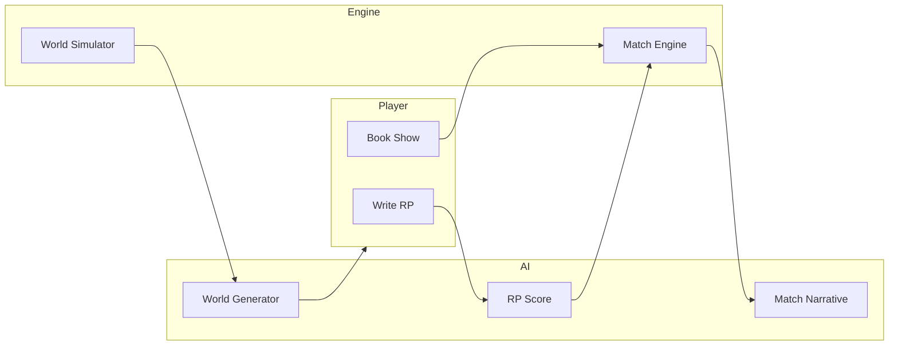

# Kayfabe Engine — Architecture

## Overview

Kayfabe Engine is an interactive E-Fed wrestling game: players write Role Plays (RPs), bookers build show cards, and the engine simulates matches and advances the world day-by-day. Real players and AI-controlled wrestlers coexist in shared worlds.

## Data Flow

- **Player** submits RP → **AI** scores RP → **Match Engine** uses RP score + stats to determine winner → **AI** generates match narrative.
- **World Simulator** advances time; can call **AI** to generate news / AI wrestler RPs.

## Firestore Structure

- `worlds/{worldId}` — World meta (name, settings, currentDate, isPublic).
- `worlds/{worldId}/federations/{fedId}` — Federations (name, prestige, roster refs, championships).
- `worlds/{worldId}/wrestlers/{wrestlerId}` — Wrestlers (stats, contract, condition, controlledBy: playerId | 'ai').
- `worlds/{worldId}/shows/{showId}` — Shows (card, segments, status, date).
- `worlds/{worldId}/roleplays/{rpId}` — Role plays (content, scores, forShow, forMatch).
- `worlds/{worldId}/storylines/{storyId}` — Storylines/feuds.
- `worlds/{worldId}/news/{newsId}` — News wire items.

Realtime: use `onSnapshot` on `worlds/{worldId}` or subcollections for multiplayer sync.

## Frontend Routing

- `/` — Home / landing.
- `/worlds` — World select (join, create, import).
- `/world/:worldId` — Entry into a world (redirects to career or roster based on role).
- `/world/:worldId/career` — MyCareer hub (wrestler/booker/owner).
- `/world/:worldId/write-rp` — RP editor.
- `/world/:worldId/show/:showId` — Show view (results, narrative).
- `/world/:worldId/roster` — Federation roster.

## Engine Layer (Headless)

- **matchEngine.js** — Given participants, RP scores, match type; returns winner, method, rating. Uses seeded RNG when provided.
- **rpScorer.js** — Calls AI to score RP (creativity, storytelling, character); returns numeric score.
- **bookerAI.js** — AI-assisted card building, feud suggestions.
- **worldSimulator.js** — advanceDay / advanceWeek: contracts, injuries, momentum, news.
- **tewConverter.js** — Parse TEW data; map to KE schemas (import/export).

No React, no DOM, no browser APIs in engine.

## AI Integration

- Frontend calls `/api/*`; Express server proxies to xAI (Grok).
- Endpoints: `/api/ai-rp-score`, `/api/ai-match-narrative`, `/api/ai-book-show`, `/api/ai-generate-world`.
- Cost tracking and caching in `aiClient.js` and `aiCostHelper.js` (same pattern as PWQ).

## Tech Stack

- **Frontend:** React 19, Vite 6, react-router-dom 7, react-i18next, Zod.
- **Backend:** Express 5, dotenv, cors.
- **Database / Auth:** Firebase (Firestore, Storage, Auth).
- **Tests:** Vitest, jsdom, @testing-library/react.
